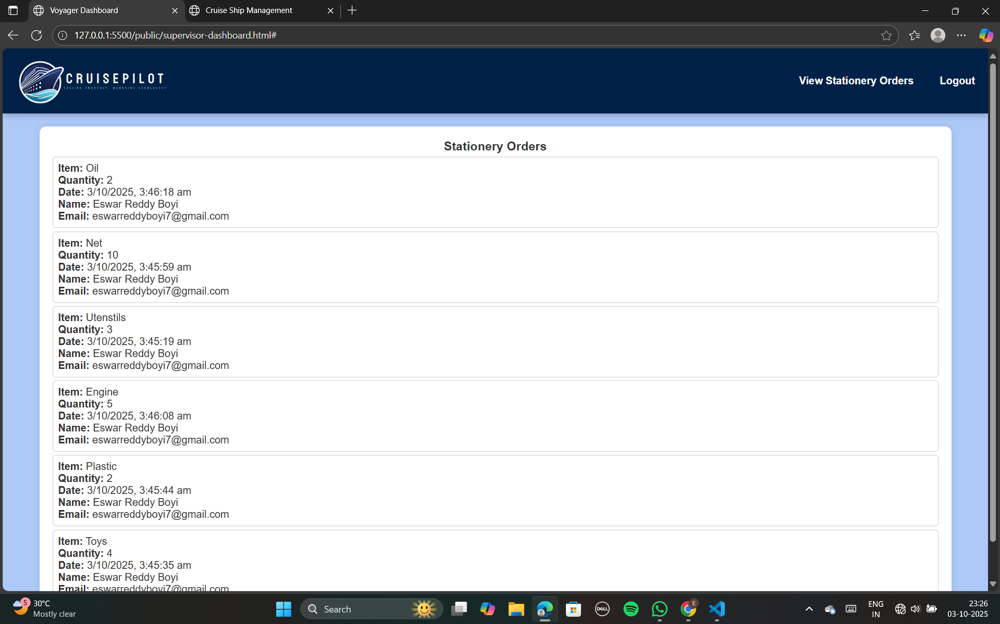

### CruisePilot - Cruise Ship Management System

A visually engaging web-based Cruise Ship Management System with login/signup functionality and dynamic animated loader effects featuring ships, rockets, and particle explosions.

-------

### Table of Contents

1. Demo

2. Features

3. Technologies

4. Installation

5. Usage

6. Screenshots

7. License

-----

Demo Link: https://cruise-shipmanagement.web.app/
 -----

### Features

User Authentication

Login & Sign Up forms

Role selection (Voyager, Admin, Manager, Head-Cook, Supervisor)

Responsive Design for mobile and desktop

Animated Loader

Ships and rockets moving across canvas

Particle explosions on logo interaction

Interactive Tabs for Login and Signup

Dynamic Canvas Animations

Safe DOM Manipulations with null-checks to prevent errors

---------

### Technologies

HTML5, CSS3, JavaScript (ES6)

Canvas API for animations

Custom particle and ship animations

Optional: External JS module for authentication (js/auth.js)

--------

### Installation

***Clone the repository***
```
git clone https://github.com/EswarReddyBoyi/cruise-ship-management.git
cd cruise-ship-management
```

Open index.html in your browser

No backend server required for frontend animations. For authentication features, ensure js/auth.js is implemented with your backend.

------------

***Usage***

Open index.html in a modern browser.

Choose a tab: Login or Sign Up.

Select your role from the dropdown.

Observe loader animation: ships, rockets, and particle explosion.

After loader completes, main UI becomes visible.

***Note:*** If you see a blank blue screen, make sure all image paths are correct in the images/ folder.

-----------

### Screenshots

<table>
  <tr>
    <th> Index Page</th>
    <th> Sign In Page</th>
    <th> Sign Up Page</th>
  </tr>
  <tr>
    <td> </td>
    <td> </td>
    <td> </td>
  </tr>
</table>

<table>
  <tr>
    <th> Voyager Dashboard Page</th>
    <th> Catering Items Page</th>
    <th> Stationery Items Page</th>
  </tr>
  <tr>
    <td> </td>
    <td> </td>
    <td> </td>
  </tr>
</table>

<table>
  <tr>
    <th> Book Services Page</th>
    <th> Admin Dashboard Page</th>
    <th> Manager Dashboard Page</th>
  </tr>
  <tr>
    <td> </td>
    <td> </td>
    <td> </td>
  </tr>
</table>

<table>
  <tr>
    <th> Resort Page</th>
    <th> Movie Page</th>
    <th> Beauty Salon Page</th>
  </tr>
  <tr>
    <td> </td>
    <td> </td>
    <td> </td>
  </tr>
</table>

<table>
  <tr>
    <th> Fitness Center Page</th>
    <th> Part Hall Page</th>
    <th> Head-Cook dashboard Page</th>
  </tr>
  <tr>
    <td> </td>
    <td> </td>
    <td> </td>
  </tr>
</table>

<table>
  <tr>
    <th> Catering Orders Page</th>
    <th> Supervisor Dashboard Page</th>
    <th> Stationery Orders Page</th>
  </tr>
  <tr>
    <td> </td>
    <td> </td>
    <td> </td>
  </tr>
</table>


------------

### License

This project is licensed under the MIT License.

MIT License allows:

Free use, modification, and distribution

Commercial and private use

No restrictions except including the original license notice


